# MLOps Assignment 2 - Submission

## Team Details

**Assignment Group:** 37

### Team Members

| S.No | Name | Student ID |
|:----:|------|------------|
| 1 | PREETY GUPTA | 2023ac05892 |
| 2 | ANKIT KUMAR AGARWAL | 2024aa05560 |
| 3 | SRITHIN NAIR | 2024ab05197 |
| 4 | VIGNESH P | 2024aa05605 |
| 5 | CHANDRABABU YELAMURI | 2024aa05820 |

### Video Recording

🎬 **Demo Video:** [View Recording](https://drive.google.com/file/d/1dWXefLiBlKdq10GGcdBUUbLjYycVRA7g/view?usp=drive_link)

---

## Project Overview

Binary image classification system for a pet adoption platform to automatically categorize uploaded pet images as **cats** or **dogs**. This project demonstrates end-to-end MLOps practices.

| Component | Details |
|-----------|---------|
| **Model** | SimpleCNN (~422K parameters) |
| **Dataset** | ~25,000 images (12,499 cats + 12,499 dogs) |
| **Training** | 2,000 images subset, 3 epochs (demo) |
| **Framework** | PyTorch 2.1 (CPU) + FastAPI |

### MLOps Pipeline

```mermaid
flowchart LR
    M1["🧠 M1<br/>Development"]
    M2["🐳 M2<br/>Packaging"]
    M3["⚙️ M3<br/>CI Pipeline"]
    M4["☸️ M4<br/>Deployment"]
    M5["📊 M5<br/>Monitoring"]

    M1 --> M2 --> M3 --> M4 --> M5

    style M1 fill:#e3f2fd,stroke:#1565c0,color:#000
    style M2 fill:#fff8e1,stroke:#f9a825,color:#000
    style M3 fill:#e8f5e9,stroke:#2e7d32,color:#000
    style M4 fill:#fce4ec,stroke:#c2185b,color:#000
    style M5 fill:#f3e5f5,stroke:#7b1fa2,color:#000
```



---

## Model Architecture (M1)

```mermaid
flowchart LR
    A["📷 Input<br/>224×224×3"] --> B["🔷 Conv Blocks<br/>3→32→64→128→256"]
    B --> C["🔹 GlobalAvgPool<br/>256"]
    C --> D["🟣 FC Layers<br/>256→128→2"]
    D --> E["🎯 Output<br/>Cat | Dog"]

    style A fill:#e1f5fe,stroke:#01579b,color:#000
    style B fill:#fff3e0,stroke:#e65100,color:#000
    style C fill:#e8f5e9,stroke:#2e7d32,color:#000
    style D fill:#f3e5f5,stroke:#7b1fa2,color:#000
    style E fill:#ffebee,stroke:#c62828,color:#000
```



**MLflow Tracked Metrics:** `train_loss`, `val_loss`, `train_accuracy`, `val_accuracy`, `val_precision`, `val_recall`, `val_f1`

---

## CI/CD Pipeline (M3)

```mermaid
flowchart LR
    subgraph CI["🔧 CI"]
        A[Checkout] --> B[Setup] --> C[Lint] --> D[Test]
        D --> E[Train] --> F[Validate] --> G[Build] --> H[Push]
    end
    subgraph CD["🚀 CD"]
        I[Deploy] --> J[Smoke Test]
    end
    H --> I

    style CI fill:#e8f5e9,stroke:#2e7d32
    style CD fill:#fff3e0,stroke:#e65100
```



---

## Kubernetes Architecture (M4)

```mermaid
flowchart LR
    subgraph Cluster["☸️ Kind Cluster"]
        SVC["Service"] --> P1["Pod 1"]
        SVC --> P2["Pod 2"]
        PROM["Prometheus"] --> GRAF["Grafana"]
        PROM --> AM["AlertManager"]
    end
    U["👤 User"] -->|:8000| SVC
    U -->|:9090| PROM
    U -->|:3000| GRAF
    P1 & P2 -.->|metrics| PROM

    style Cluster fill:#fff8e1,stroke:#f9a825
```



---

## Monitoring Architecture (M5)

```mermaid
flowchart LR
    subgraph Sources["📊 Sources"]
        API["API"]
        NE["Node Exporter"]
        KSM["Kube-State"]
    end
    subgraph Prometheus["📈 Prometheus"]
        P["Scrape & Store"]
        R["13 Alert Rules"]
    end
    subgraph Output["📤 Output"]
        G["Grafana"]
        AM["AlertManager"]
        E["📧 Email"]
    end

    API & NE & KSM --> P --> R
    P --> G
    R --> AM --> E

    style Sources fill:#e3f2fd,stroke:#1565c0
    style Prometheus fill:#fff3e0,stroke:#e65100
    style Output fill:#e8f5e9,stroke:#2e7d32
```



---

## Milestones Completed

| Milestone | Title | Deliverables |
|:---------:|-------|--------------|
| **M1** | Model Development & Experiment Tracking | SimpleCNN model, MLflow tracking, DVC data versioning |
| **M2** | Model Packaging & Containerization | FastAPI application, Docker container, health endpoints |
| **M3** | CI Pipeline (Jenkins) | 11-stage pipeline, automated testing, Docker push to GHCR |
| **M4** | CD Pipeline & Kubernetes | Kind cluster, 2-replica deployment, NodePort services, HPA |
| **M5** | Monitoring & Logging | Prometheus, Grafana dashboards, 13 alert rules, email notifications |

---

## API Endpoints

| Endpoint | Method | Description |
|----------|--------|-------------|
| `/health` | GET | Liveness probe |
| `/ready` | GET | Readiness probe |
| `/predict` | POST | Model inference |
| `/metrics` | GET | Prometheus metrics |
| `/docs` | GET | Swagger UI |

---

## Jenkins Pipeline Stages

**11 Stages:** Checkout → Setup Python → Lint → Unit Tests → Download Data → Train → Validate → Docker Build → Push → Deploy → Smoke Tests

---

## Kubernetes Deployment

| Configuration | Value |
|---------------|-------|
| Cluster | Kind (Kubernetes in Docker) |
| Namespace | mlops |
| Replicas | 2 pods |
| Scaling | HPA enabled |

### Access Points

| Service | URL |
|---------|-----|
| API | http://localhost:8000 |
| Prometheus | http://localhost:9090 |
| Grafana | http://localhost:3000 |
| AlertManager | http://localhost:9093 |

---

## Monitoring & Alerting

### Alert Rules (13 Total)

| Category | Alerts |
|----------|--------|
| Application | HighPredictionRate, HighErrorRate, HighLatency, CriticalLatency, NoPredictions |
| Kubernetes | PodNotReady, PodCrashLooping, ReplicasMismatch, HPAAtMax |
| System | HighCPU, CriticalCPU, HighMemory, CriticalMemory, HighDisk |

---

## Technology Stack

| Component | Technology |
|-----------|------------|
| Language | Python 3.11 |
| ML Framework | PyTorch 2.1 (CPU) |
| API | FastAPI |
| Experiment Tracking | MLflow |
| Data Versioning | DVC |
| Container | Docker |
| Container Registry | GitHub Container Registry (GHCR) |
| Orchestration | Kubernetes (Kind) |
| CI/CD | Jenkins |
| Monitoring | Prometheus + Grafana |
| Alerting | AlertManager |

---

## Repository

**GitHub:** https://github.com/2024aa05820/mlops-assignment2

---

## Submission Contents

- Source code (`src/`, `tests/`, `scripts/`)
- Kubernetes manifests (`deploy/k8s/`)
- Jenkinsfile for CI/CD pipeline
- Dockerfile for containerization
- README.md with documentation
- Screen recording demonstrating complete workflow

---

## Project Structure

```
mlops-assignment2/
├── src/
│   ├── api/app.py              # FastAPI application
│   ├── models/train.py         # Training script with MLflow
│   └── models/cnn.py           # SimpleCNN architecture
├── deploy/k8s/                 # Kubernetes manifests
├── tests/                      # Unit tests
├── Dockerfile                  # Container definition
├── Jenkinsfile                 # CI/CD pipeline
└── Makefile                    # Automation commands
```

